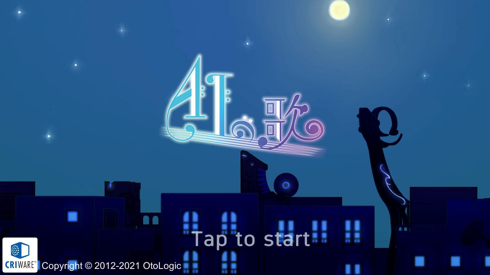

&nbsp;



#　概要
[GitHubリポジトリ](https://github.com/KURO-Games/songForAI.git)
## コンセプト


## 制作意図
We,areTECH.C(卒業、進級制作展)2021出展用ゲームのチーム制作作品

## プラットフォーム
ipad

## 使用言語
C#
Unity 2021.2.5f1


# 担当箇所

```cs
public class ClearDisplay : SingletonMonoBehaviour<ClearDisplay>
{
    [SerializeField]
    private Animator animator;

    private static          bool isDisplayed;
    private static readonly int  FullCombo = Animator.StringToHash("FullCombo");
    private static readonly int  Clear     = Animator.StringToHash("Clear");

    private void Start()
    {
        isDisplayed = false;
    }

    /// <summary>
    /// クリア・フルコンボアニメーションを表示する
    /// </summary>
    public static void Show()
    {
        if (isDisplayed) return;

        isDisplayed = true;

        //FullCombo表示
        if (NotesJudgementBase.TotalGrades[2] == 0 &&
            NotesJudgementBase.TotalGrades[3] == 0 &&
            NotesJudgementBase.TotalGrades[4] == 0)
        {
            Instance.animator.SetTrigger(FullCombo);
        }
        //クリア表示
        else if (NotesJudgementBase.bestCombo > 0)
        {
            Instance.animator.SetTrigger(Clear);
        }
    }
}
```
アニメーションを作成しました。

