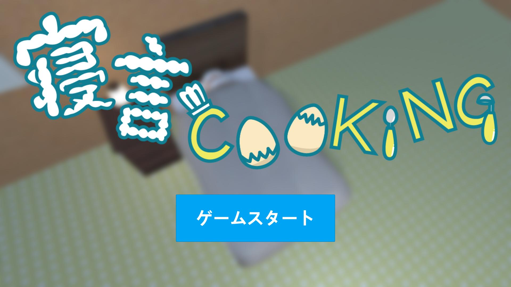

&nbsp;



# コンセプト
料理ゲームとステルスゲームを融合することで料理の楽しさとステルスゲームのスリルを同時に味わえる。

# 制作意図
東京ゲームショウ2020出展用ゲームのチーム制作作品

# プラットフォーム
PC

# 使用言語
C#
Unity 2019.2.21f1

# 担当箇所

## 制限時間の処理

```cs
public class TimeCounter : MonoBehaviour
{
    //カウントアップ
    public static float CountUp = 500.0f;

    public static float CurrentTime = CountUp;

    // カウントが止まっているか否か
    public static bool IsStopped;

    //タイムリミット
    [SerializeField]
    private float timeLimit;

    //時間を表示するText型の変数
    [SerializeField]
    private Text timeText;

    [SerializeField]
    private Image nightIcon;

    [SerializeField]
    private Image morningIcon;

    private Vector3 _morningPos;

    private Vector3 _nightPos;

    private IEnumerator Start()
    {
        // 何故か開始時と1フレーム後とで各アイコンの座標値が変化するので、1フレーム待機
        yield return null;

        _morningPos = morningIcon.transform.position;
        _nightPos   = nightIcon.transform.position;
    }

    // Update is called once per frame
    private void Update()
    {
        Debug.Log("Time: before");
        // 朝アイコンの座標が取得されるまで待機（↑の1フレーム待機による処置）
        if (_morningPos == default || IsStopped) return;

        Debug.Log("Time: after");

        // 時間をカウントする
        CurrentTime   -= Time.deltaTime;
        timeText.text =  CurrentTime.ToString("F1");

        // 時間を表示する
        // 時間を表示しなくなったことによりCO
        // timeText.text = CurrentTime.ToString("0");

        // 朝アイコンを残り時間に応じて徐々に表示
        morningIcon.transform.position = Vector3.Lerp(_nightPos, _morningPos, CurrentTime / CountUp);

        // タイムアップでゲームオーバー
        if (CurrentTime <= timeLimit)
        {
            MasterController.Instance.Judgement();
            SceneChanger.Instance.SceneLoad(SceneChanger.SceneName.Result);
        }
    }
}
```

メインゲームの制限時間を制御する処理を作りました。

## ポーズの処理

```cs
public class Pause : MonoBehaviour
{
    private GameObject  _pauseCanvas;
    private CanvasGroup _pauseCanvasGroup;
    private CanvasGroup _playerCanvasGroup;

    private void Start()
    {
        _pauseCanvas      = GameObject.FindGameObjectWithTag("PauseCanvas");
        _pauseCanvasGroup = _pauseCanvas.GetComponent<CanvasGroup>();
        _playerCanvasGroup = GameObject.FindGameObjectWithTag("PlayerInventory")
                                       .GetComponent<CanvasGroup>();
    }

    public void GoTitle()
    {
        SoundManager.Instance.PlaySe(SE.Submit);
        _pauseCanvasGroup.alpha = 0;
        Time.timeScale          = 1f;
        SceneChanger.Instance.SceneLoad(SceneChanger.SceneName.TitleScenes);
    }

    public void ReturnGame()
    {
        StartCoroutine(PushPause.Instance.ReturnToGame());
    }
}
```

ゲーム中断するための処理を作りました。
