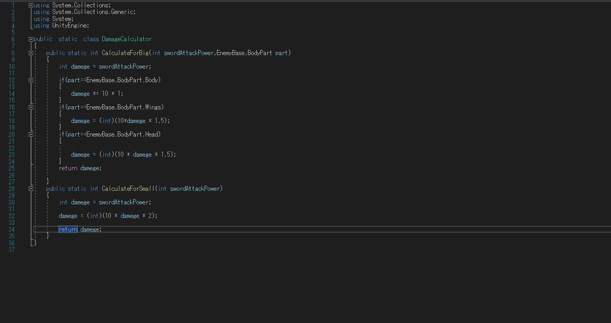
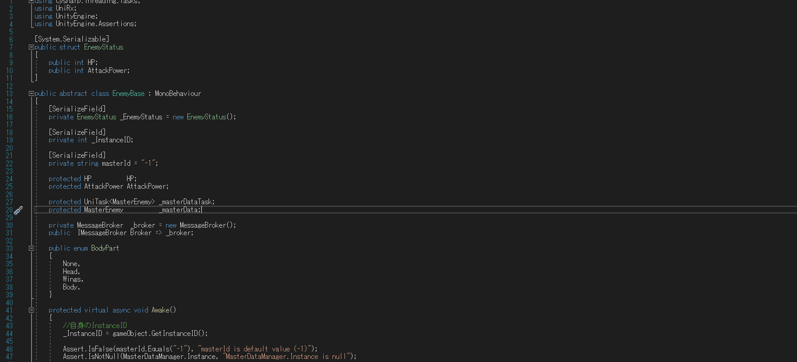

&nbsp;

# コンセプト
剣を投げて相手にワープし剣を切ることで敵を倒す、3Dアクションゲームです。

# 制作意図
東京ゲームショウ2022出展用ゲームのチーム制作作品

# プラットフォーム
Nintendo Switch

# 使用言語
C#
Unity 2021.2.15f1

# 担当箇所

 
魔物に与えるダメージの計算処理の実装をしました。部位ごとに決まった倍率を適用した値が算出されます。

 
エネミーの部位の判定とダメージを受けた時の処理を行いました。
